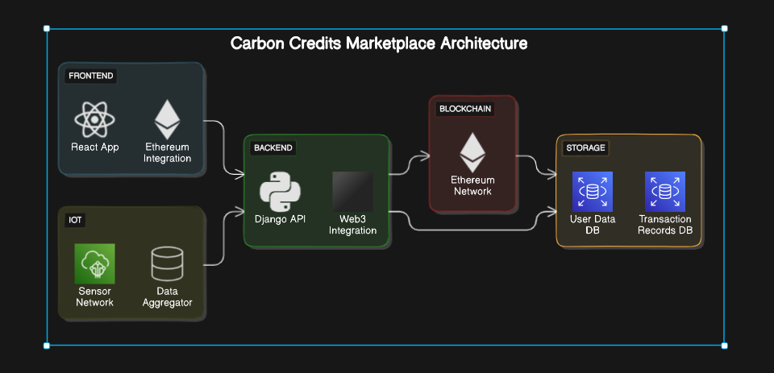

# Carbon Credit Marketplace

### Overview
This project is a carbon credit marketplace designed to facilitate the trading of carbon credits between individuals and organizations. It leverages React for the front-end, a Smart Contract for handling transactions, and IoT devices for gathering environmental data.

...
